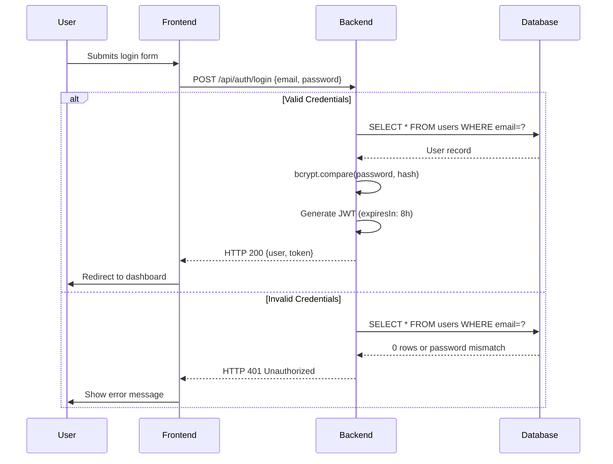

# Pet Hostel Backend API


Backend API for pet boarding management with secure authentication and role-based access control.

## ✨ Features

- **Secure Authentication** - JWT token-based with bcrypt password hashing
- **Pet Booking System** - Complete reservation lifecycle management
- **Staff Administration** - Role-based access control
- **RESTful API** - Built with Express.js
- **TypeSafe Development** - Full TypeScript support

## 🔐 Authentication Flow

### Login Sequence Diagram


## 📦 Prerequisites

- [Node.js](https://nodejs.org/) v18+
- [MySQL](https://www.mysql.com/) 8.0+
- [npm](https://www.npmjs.com/) 9+

## 🛠️ Installation

1. **Clone the repository:**
   ```bash
   git clone https://github.com/Irminsul-Devs/pet-hostel-backend.git
   cd pet-hostel-backend
   ```

2. **Install dependencies:**
   ```bash
   npm install
   ```

3. **Configure environment:**
   ```bash
   cp .env.example .env
   ```
   Edit `.env` with your credentials:
   ```ini
   DB_HOST=localhost
   DB_USER=your_mysql_user
   DB_PASSWORD=your_password
   DB_NAME=pet_hostel
   PORT=5000
   JWT_SECRET=your_secure_secret_here
   ```
   
## Database Setup

**Option 1: Command Line**
```bash
mysql -u root -p pet_hostel < schema.sql
```

**Option 2: phpMyAdmin**
1. Login to phpMyAdmin
2. Create `pet_hostel` database
3. Import `schema.sql` file

## 🚀 Running the Server

| Command          | Description                     |
|------------------|---------------------------------|
| `npm run dev`    | Development mode (hot-reload)   |
| `npm run build`  | Create production build         |
| `npm start`      | Run production server          |

## 📂 Project Structure

```
pet-hostel-backend/
├── src/
│   ├── controllers/    # Business logic
│   ├── routes/         # API endpoints
│   └── index.ts        # Server entry point
├── schema.sql          # Database schema
├── .env.example        # Environment template
├── package.json        # Project configuration
└── tsconfig.json       # TypeScript settings
```

## 🔌 API Endpoints

### Authentication
| Endpoint            | Method | Description          |
|---------------------|--------|----------------------|
| `/api/auth/signup`  | POST   | Register new user    |
| `/api/auth/login`   | POST   | User login           |

## 🤝 Contributing

We welcome contributions! Please follow these steps:

1. Fork the repository
2. Create your feature branch:
   ```bash
   git checkout -b feature/your-feature
   ```
3. Commit your changes:
   ```bash
   git commit -m 'Add some feature'
   ```
4. Push to the branch:
   ```bash
   git push origin feature/your-feature
   ```
5. Open a Pull Request

## 📜 License

This project is licensed under the **ISC License** © 2025 Irminsul Devs